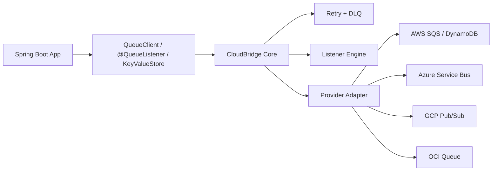

# CloudBridge

CloudBridge is a Java 21 Spring Boot starter that gives you one portable programming model for queue messaging, listener execution, retry/DLQ handling, and simple key-value storage.

The goal is to keep application code cloud-agnostic while letting adapters handle provider details.

## Current Status

- Implemented messaging providers: AWS, Azure, GCP, OCI
- Implemented storage provider: AWS
- Java version: 21
- Packaging: Spring Boot auto-configuration based starter library

## What It Provides

### Messaging API

- `QueueClient` for sending messages
- `CloudMessage` as the normalized message envelope
- `SendOptions` for portable send hints such as delay
- `@QueueListener` for listener methods
- `Acknowledgement` for explicit ack/nack handling

### Listener Engine

- Annotation scanning for `@QueueListener`
- Listener registry and endpoint model
- Thread-pool-backed dispatch
- Method invocation with `CloudMessage`, payload `String`, and `Acknowledgement`

### Retry and DLQ

- Configurable retry policy
- Backoff support
- Dead-letter publishing through a portable abstraction
- Default DLQ naming with `queue + dlqSuffix`

### Configuration System

- `cloud.*` configuration binding
- Provider selection through `cloud.provider`
- Auto-configured messaging, listener, retry, and storage beans

### Storage

- `KeyValueStore` abstraction
- AWS DynamoDB implementation

### Provider Adapters

- AWS SQS queue sender and polling consumer
- Azure Service Bus sender and consumer
- GCP Pub/Sub sender and consumer

## Feature Matrix

| Feature | AWS | Azure | GCP | OCI |
| --- | --- | --- | --- | --- |
| Queue send | Yes | Yes | Yes | Yes |
| Queue receive | Yes | Yes | Yes | Yes |
| Listener engine | Yes | Yes | Yes | Yes |
| Retry + DLQ pipeline | Yes | Yes | Yes | Yes |
| Delayed delivery | Yes | Yes | No portable scheduler in current adapter | Yes |
| Key-value storage | DynamoDB | No | No | No |

## Project Structure

```text
src/main/java/io/cloudbridge
  autoconfigure/
  aws/
  azure/
  config/
  core/
  gcp/
  listener/
  retry/
```

## How It Works



## Local Build

### Prerequisites

- Java 21
- Gradle 8.x installed locally, or a Gradle wrapper added to the repo

### Build Commands

```powershell
gradle clean build
```

Run tests:

```powershell
gradle test
```

Publish to the local Maven cache:

```powershell
gradle publishToMavenLocal
```

Publish to the local build repository at `build/repo`:

```powershell
gradle publish
```

## Use In Another Spring Boot Project

Add the dependency:

```kotlin
dependencies {
    implementation("io.cloudbridge:cloud-bridge-spring-boot-starter:0.1.0-SNAPSHOT")
}
```

CloudBridge uses Spring Boot auto-configuration, so no manual `@Configuration` import is required.

## Minimal Usage

### 1. Configure a provider

AWS:

```yaml
cloud:
  provider: AWS
  aws:
    region: us-east-1
    endpoint: http://localhost:4566
  storage:
    tableName: cloud_bridge_kv
  messaging:
    retry:
      maxAttempts: 3
      backoffMs: 2000
```

Azure:

```yaml
cloud:
  provider: AZURE
  azure:
    connectionString: Endpoint=sb://your-namespace.servicebus.windows.net/;SharedAccessKeyName=...
```

GCP:

```yaml
cloud:
  provider: GCP
  gcp:
    projectId: your-project-id
```

OCI:

```yaml
cloud:
  provider: OCI
  oci:
    endpoint: https://cell-1.queue.messaging.<region>.oci.oraclecloud.com
    configFilePath: ~/.oci/config
    profile: DEFAULT
```

### 2. Send a message

```java
import io.cloudbridge.core.messaging.CloudMessage;
import io.cloudbridge.core.messaging.QueueClient;
import io.cloudbridge.core.messaging.SendOptions;
import java.time.Duration;
import org.springframework.stereotype.Service;

@Service
public class OrderPublisher {

    private final QueueClient queueClient;

    public OrderPublisher(QueueClient queueClient) {
        this.queueClient = queueClient;
    }

    public void publish(String payload) {
        CloudMessage message = new CloudMessage(payload);
        queueClient.send("order-events", message, new SendOptions(Duration.ofSeconds(5)));
    }
}
```

### 3. Consume a message

```java
import io.cloudbridge.core.messaging.Acknowledgement;
import io.cloudbridge.core.messaging.CloudMessage;
import io.cloudbridge.core.messaging.QueueListener;
import org.springframework.stereotype.Component;

@Component
public class OrderListener {

    @QueueListener(value = "order-events", concurrency = 4)
    public void handle(CloudMessage message, Acknowledgement acknowledgement) {
        process(message.payload());
        acknowledgement.ack();
    }

    private void process(String payload) {
    }
}
```

### 4. Use key-value storage

```java
import io.cloudbridge.core.storage.KeyValueStore;
import org.springframework.stereotype.Service;

@Service
public class OrderStateStore {

    private final KeyValueStore keyValueStore;

    public OrderStateStore(KeyValueStore keyValueStore) {
        this.keyValueStore = keyValueStore;
    }

    public void save(String orderId, String payload) {
        keyValueStore.put(orderId, payload);
    }
}
```

## Configuration Reference

### Root

```yaml
cloud:
  provider: AWS | AZURE | GCP | OCI
```

### Messaging

```yaml
cloud:
  messaging:
    dlqSuffix: .dlq
    receiveWaitSeconds: 10
    idleBackoffMs: 1000
    listener:
      defaultConcurrency: 1
      workerThreads: 4
      queueCapacity: 100
    retry:
      maxAttempts: 3
      backoffMs: 2000
```

### AWS

```yaml
cloud:
  aws:
    region: us-east-1
    endpoint: http://localhost:4566
    queuePrefix: ""
    dynamoTable: cloud_bridge_kv
```

### Azure

```yaml
cloud:
  azure:
    connectionString: ...
```

### GCP

```yaml
cloud:
  gcp:
    projectId: your-project-id
    emulatorHost: localhost:8085
```

### OCI

```yaml
cloud:
  oci:
    endpoint: https://cell-1.queue.messaging.<region>.oci.oraclecloud.com
    configFilePath: ~/.oci/config
    profile: DEFAULT
    channelConsumptionLimit: 10
    visibilityInSeconds: 30
    pollingTimeoutSeconds: 10
```

### Storage

```yaml
cloud:
  storage:
    tableName: cloud_bridge_kv
```

## Spring Beans Auto-Configured

Depending on provider and classpath, CloudBridge wires these core beans:

- `QueueClient`
- `QueueConsumerFactory`
- `QueueListenerRegistry`
- `QueueListenerMethodInvoker`
- `QueueListenerContainerManager`
- `RetryPolicy`
- `RetryExecutor`
- `DeadLetterPublisher`
- `CloudCapabilities`
- `KeyValueStore` for AWS
- Provider SDK clients such as `SqsClient`, `DynamoDbClient`, and `ServiceBusClientBuilder`

## Functional Notes

### Acknowledgement model

- Call `ack()` when processing succeeds
- Call `nack(Throwable)` when processing should fail immediately
- In the current AWS adapter, `ack()` deletes the SQS message and `nack()` leaves it for redelivery
- The current listener pipeline also acknowledges automatically when the listener method returns successfully
- Current adapter acknowledgement implementations are idempotent, so an explicit `ack()` and the framework success path do not conflict

### Retry behavior

- Listener execution runs through `RetryExecutor`
- Success triggers `ack()`
- Repeated failure retries until `maxAttempts`
- After the final failure, CloudBridge publishes the message to the DLQ destination and then acknowledges the original message

### Listener method signatures supported

- `void handle(CloudMessage message)`
- `void handle(String payload)`
- `void handle(CloudMessage message, Acknowledgement acknowledgement)`
- `void handle(String payload, Acknowledgement acknowledgement)`

### Delayed delivery

- AWS uses SQS delay seconds when `SendOptions.delay()` is set
- Azure uses scheduled enqueue time
- GCP adapter currently ignores send delay because the current portable adapter does not implement provider-specific scheduling
- OCI uses per-message delay when `SendOptions.delay()` is set

### Destination semantics by provider

- AWS listener and send destinations are queue names
- Azure listener and send destinations are queue names
- GCP listener and send destinations are topic or subscription names, depending on producer or consumer context
- OCI listener and send destinations are queue OCIDs in the current adapter

## Local Development With AWS LocalStack

Example local config:

```yaml
cloud:
  provider: AWS
  aws:
    region: us-east-1
    endpoint: http://localhost:4566
```

Typical flow:

1. Start LocalStack.
2. Create the SQS queue and DynamoDB table.
3. Start your Spring Boot app.
4. Inject `QueueClient` and `KeyValueStore`.
5. Send messages and verify listener execution.

## Publishing

### Publish to local Maven cache

```powershell
gradle publishToMavenLocal
```

### Publish to the repo-local build repository

```powershell
gradle publish
```

Artifacts are written to:

```text
build/repo/io/cloudbridge/cloud-bridge-spring-boot-starter/
```

### Publish to a remote Maven repository

Add a real repository block in `build.gradle.kts`, for example:

```kotlin
publishing {
    repositories {
        maven {
            name = "companyRepo"
            url = uri("https://repo.example.com/releases")
            credentials {
                username = findProperty("repoUser") as String?
                password = findProperty("repoPassword") as String?
            }
        }
    }
}
```

Then run:

```powershell
gradle publish
```

## Limitations

- Storage is currently implemented only for AWS DynamoDB
- There is no Gradle wrapper committed yet
- External-provider integration tests are not wired yet
- Current publication metadata uses placeholder GitHub coordinates and should be replaced

## Docs

- [Examples hub](docs/examples/README.md)
- [AWS example](docs/examples/aws-example.md)
- [Multi-cloud example](docs/examples/multi-cloud-example.md)
- [Blog draft](docs/blog/cloud-bridge-cloud-agnostic-spring-boot-starter-draft.md)
- [Task tracker](docs/tasks/00-overview.md)

## Keywords

- spring boot multi cloud
- cloud agnostic java
- aws sqs alternative
- multi-cloud messaging
- portable queue listener
- spring boot messaging starter
