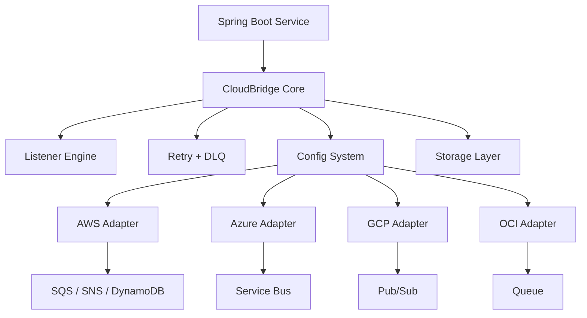

# CloudBridge: A Cloud-Agnostic Spring Boot Starter for Messaging and Storage

## Draft Summary

CloudBridge is a Spring Boot starter that reduces cloud vendor lock-in for common messaging and storage workflows.
It provides a stable API for queues, listeners, acknowledgements, retry handling, and key-value storage across AWS, Azure, GCP, and OCI.

## Problem

Modern Spring Boot services often hard-code provider SDKs and annotations directly into application code.
That approach works until the team needs to migrate providers, run multi-cloud deployments, or standardize event handling across services.

## Solution

CloudBridge uses a capability-driven abstraction:

- One portable queue client
- One listener annotation
- One acknowledgement model
- One storage abstraction for basic key-value access
- Provider adapters behind a Spring Boot-friendly configuration layer

## Architecture

## Example Use Case

An order service can publish an event, process a queue message, and persist state without binding the domain code to a specific cloud provider.
The provider can then change by configuration instead of a rewrite.

## Why Java 21

CloudBridge targets Java 21 so the project can use a modern baseline and keep the supported version set simple.

## Suggested Blog Structure

1. Problem statement and vendor lock-in
2. The CloudBridge abstraction model
3. Architecture diagram
4. Example usage with configuration
5. Supported providers and known limitations
6. Call to action for contributors

## SEO Keywords

- spring boot multi cloud
- cloud agnostic java
- aws sqs alternative
- cloud-agnostic starter
- portable event processing

