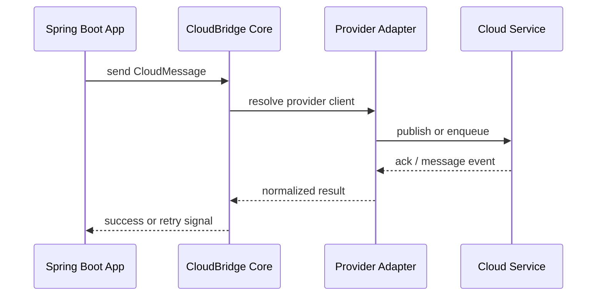

# Multi-Cloud Example

This example shows the same Spring Boot application switching providers through configuration only.
The application code stays the same while the adapter changes underneath.

## Goal

Demonstrate that CloudBridge can move between AWS, Azure, and GCP without rewriting the business logic.

## Flow



## Provider Switch

```yaml
cloud:
  provider: aws
```

```yaml
cloud:
  provider: azure
```

```yaml
cloud:
  provider: gcp
```

## What Stays Stable

- `QueueClient`
- `CloudMessage`
- `SendOptions`
- `@QueueListener`
- `Acknowledgement`

## What Changes

- The provider adapter
- The queue or topic backend
- The provider-specific retry and DLQ behavior

